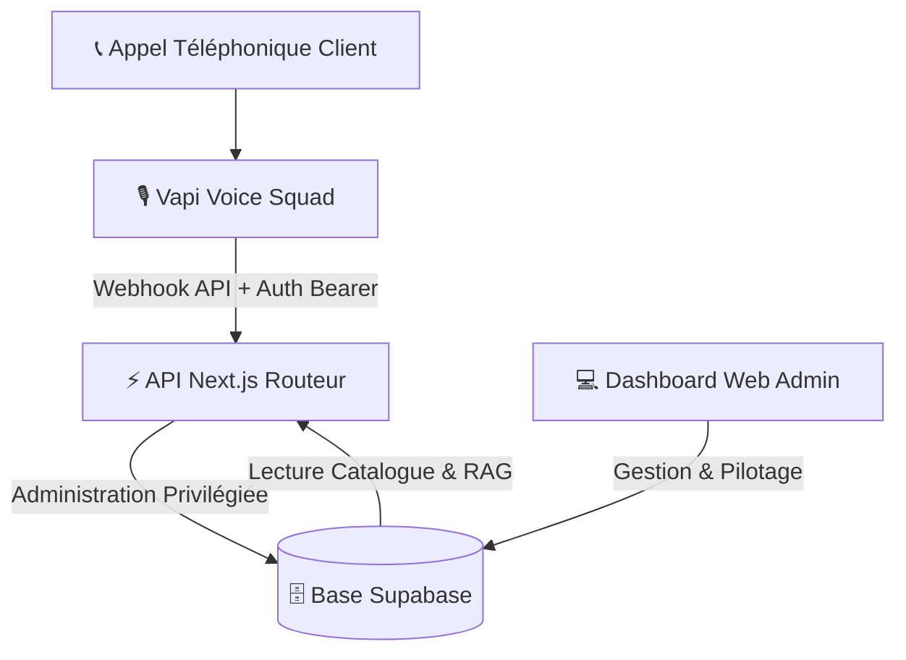

# 🐟 Contexte de l'Application : Delicatessen Vocal - Maison Fumesse

Bienvenue dans le document de référence de **Maison Fumesse** (Delicatessen Vocal), un écosystème de commerce vocal B2B de pointe couplé à une interface d'administration Next.js. Ce système permet de prendre des commandes de produits de la mer de manière entièrement vocale via un assistant IA (squad d'agents Vapi), connecté en temps réel à une base de données Supabase et à un moteur de recherche de connaissances optimisé.

---

## 📌 Vision Globale

L'application **Delicatessen Vocal** permet aux poissonniers, restaurateurs, acheteurs de la grande distribution (GMS), et particuliers de passer commande par téléphone en discutant naturellement avec un assistant virtuel commercial expert.

L'objectif principal est de **qualifier le client**, **proposer des produits frais au juste prix**, **traiter les objections** de manière professionnelle, et **enregistrer la commande** instantanément dans la base de données de l'atelier, le tout avec une latence quasi-nulle.

---

## 🏛️ Architecture du Système

L'application repose sur trois piliers technologiques :

### 1. Le Squad d'Agents Vocaux (Vapi)
Pour offrir une expérience fluide sans temps mort, l'assistant utilise une architecture de **Squad (multi-agents)** sur Vapi :
* **Agent 1 - Le Routeur** : Accueille le client, qualifie son statut (Client existant ou Prospect) et l'oriente vers l'agent adéquat.
* **Agent 2 - Le Preneur de Commande** : Enregistre efficacement les lignes de commande des clients habitués pressés.
* **Agent 3 - Le Closer / Expert Marée** : Gère les objections complexes, négocie les prix au volume, et conseille les nouveaux prospects ou particuliers.

### 2. Le Dashboard Web (Next.js App Router)
Une interface d'administration moderne permet au gérant de l'atelier de piloter toute l'activité :
* **🐟 Produits & Stocks** : Visualisation du catalogue de marée, des prix de base et de l'état des stocks.
* **👥 Fichier Clients** : Suivi des comptes clients (limite de 450 comptes maximum) et enregistrement automatique des nouveaux prospects.
* **📈 Tarification & Formules** : Outil de calcul de marge dynamique qui applique des coefficients spécifiques pour chaque groupe tarifaire (`06`, `08`, `09`, `10`) et recalcule l'intégralité du catalogue instantanément.
* **🧠 Base de Connaissances (RAG)** : Interface de saisie manuelle et d'import pour enrichir les fiches techniques des produits (provenance, saisonnalité, calibres, conseils).
* **🔥 Promotions** : Pilotage des promotions flash pour écouler les surstocks.

### 3. La Base de Données (Supabase)
Un stockage PostgreSQL hébergeant les tables suivantes :
* `products` : Liste des poissons, prix de base, et grilles tarifaires par groupe.
* `clients` : Coordonnées, statut (pro/particulier), et groupe tarifaire associé.
* `orders` & `order_items` : Commandes validées par l'assistant ou via l'administration.
* `products_knowledge` : Fiches techniques utilisées par le moteur de recherche de l'assistant commercial.

---

## 🧠 Moteur RAG & Optimisation de la Latence

Pour permettre à l'assistant de répondre précisément aux questions techniques ("D'où vient votre bar ?", "Quelle est la saisonnalité du lieu noir ?"), un système de RAG (Retrieval-Augmented Generation) ultra-rapide a été conçu.

### ⚡ Stratégie Anti-Latence RAG (Hybride BDD)
Dans un appel téléphonique, une attente de plus de 1,5 seconde détruit l'expérience utilisateur. L'utilisation d'embeddings vectoriels classiques ou de requêtes LLM intermédiaires générerait une latence inacceptable. Pour éliminer cette latence, un RAG hybride à double niveau a été implémenté :
1. **Dictionnaire de Mots-Clés Prioritaires (Composés & Simples)** : Recherche instantanée et hiérarchisée sur les espèces de référence locales et importées (57 espèces au total, incluant le Bar d'élevage de Turquie, la Daurade royale de Turquie, le Saumon Atlantique d'élevage, le Turbot d'élevage, la Truite arc-en-ciel, l'Esturgeon d'élevage, l'Huître d'élevage, les Moules d'élevage, le Bigorneau, la Palourde européenne, le Couteau d'Europe, la Coque commune, le Bulot / buccin, l'Amande de mer, le Pétoncle noir ou blanc, la Langoustine côtière, le Homard européen / bleu, l'Huître plate de Zélande, l'Huître creuse "Creuse de Zélande", la Coquille Saint-Jacques sauvage, les Moules de Zélande, la Sole de la Mer du Nord / Noordzeetong, le Hareng Hollandse Nieuwe / Matjes, le Turbot sauvage de la Mer du Nord, le Flet commun de Hollande, le Tacaud commun des Pays-Bas, le Saumon des Îles Féroé, le Lieu jaune des côtes anglaises, le Rouget-barbet de Cornouailles, le Turbot de la Manche anglaise, le Saumon de Norvège, le Skrei, etc.).
2. **Recherche Textuelle Floue (Fallback)** : Découpage intelligent des 3 premiers mots significatifs saisis par l'IA et recherche par motif SQL (`ilike %mot%`).

Cette approche garantit un temps de réponse **inférieur à 150ms** (généralement autour de 50ms) pour la récupération de la connaissance produit.

### ⚡ Optimisation de la Latence de la Pile Vocale (STT, TTS & Endpointing)
Afin de faire descendre la latence globale ressentie par l'utilisateur sous la barre fatidique de **1.0 seconde** (environ **700ms - 900ms** en production), une refonte complète de la pile vocale et du plan de prise de parole a été menée :
1. **Moteur TTS (Text-to-Speech) Ultra-Rapide** : Passage au modèle d'ElevenLabs **`eleven_flash_v2_5`** pour les trois agents de la squad. Ce modèle optimisé pour le temps réel réduit la latence de génération vocale de **~1200ms à ~75ms-150ms**, tout en conservant une diction et un accent français parfaits (appuyés par nos règles de transcription en toutes lettres).
2. **Transcripteur STT de Dernière Génération** : Remplacement de Deepgram `nova-2` par **`flux-general-multi`**. Ce modèle gère nativement et de manière asynchrone la détection de fin de tour de parole (EOT) en français.
3. **Planification Heuristique des Silences (`startSpeakingPlan`)** : Configuration d'un plan d'endpointing personnalisé (`transcriptionEndpointingPlan`) sur les configurations et surcharges de la squad pour abréger l'attente après parole à **0.8 seconde** de silence (au lieu de 1.5 seconde par défaut). Cela élimine **700ms** de blanc inerte.

### 📦 Lots Thématiques & Couverture Géographique
La base de connaissances de 57 espèces a été intégrée de manière incrémentale par lots géographiques et technologiques cohérents :
* **Belges et Mer du Nord (11 espèces)** : Espèces locales de petite pêche comme le Grondin rouge/Coucou de mer, Carrelet, Sole de petite pêche, etc.
* **Nordiques (8 espèces)** : Poissons des eaux froides de Norvège et d'Islande (Skrei, Saumon de Norvège, Sébaste d'Islande, Loup anarhique, etc.).
* **Côtes Anglaises et Îles Féroé (7 espèces)** : Produits des courants intenses (Lieu jaune, Rouget-barbet de Cornouailles, Saumon des Féroé, etc.).
* **Côtes Hollandaises (7 espèces)** : Poissons plats et pélagiques (Flet de Hollande, Sole de la Mer du Nord/Noordzeetong, Hareng Hollandse Nieuwe, etc.).
* **Coquillages & Crustacés Premium (6 espèces)** : Produits phares de Zélande et Manche (Langoustine, Homard bleu, Huître plate et creuse de Zélande, etc.).
* **Coquillages Sauvages Européens (7 espèces)** : Coquillages sauvages pêchés à pied ou dragués (Palourde, Couteau d'Europe, Coque, Bulot, Amande, Pétoncle, Bigorneau).
* **Aquaculture & Conchyliculture d'Élevage (8 espèces)** : Intégration des filières technologiques de Turquie (Bar et Daurade royale en Mer Égée) et européennes (Saumon, Turbot d'élevage, Truite arc-en-ciel, Esturgeon d'élevage/Caviar, Huîtres et Moules d'élevage).

### 🎯 Personnalisation Professionnel vs Particulier
Le moteur de connaissances adapte dynamiquement la réponse générée selon la typologie du client :
* **Client Professionnel (B2B)** : Pas besoin de conseils de cuisson. L'IA omet l'option `conseils_preparation` pour abréger l'appel et se concentrer uniquement sur les calibres, la provenance et la saisonnalité.
* **Client Particulier (B2C)** : L'IA inclut automatiquement des conseils de préparation et de cuisson détaillés pour l'accompagner et enrichir son expérience d'achat.

---

## 🔒 Sécurité & Bonnes Pratiques

Le code a été audité et renforcé selon des standards de sécurité de niveau production :

> [!IMPORTANT]
> **Authentification des Webhooks**
> Tous les appels entrants de Vapi vers l'endpoint `/api/vapi/webhook` doivent être sécurisés. Pour une robustesse et une interopérabilité maximales avec Vapi (qui peut formater ses requêtes d'outils différemment des webhooks systèmes), l'API accepte plusieurs formats de signature :
> * `Authorization: Bearer <secret>`
> * `Authorization: <secret>` (brut)
> * `x-vapi-secret: <secret>`
> L'API compare ces valeurs au secret attendu (défini par `process.env.VAPI_WEBHOOK_SECRET` ou son fallback statique `'delicatessen-vapi-webhook-secret-2026'`). Si aucun de ces formats n'est valide, un statut `401 Unauthorized` est renvoyé immédiatement.

> [!WARNING]
> **Masquage des Erreurs & Anti-Fuite d'Informations**
> * Aucun message d'erreur interne PostgreSQL ou système ne doit être exposé à l'extérieur. Les blocs `catch` des routes API renvoient une erreur générique `"Internal Server Error"` ou `"Erreur interne"`. Les traces détaillées sont uniquement écrites côté serveur via `console.error`.
> * La clé d'administration privilégieuse `supabaseAdmin` contourne la sécurité Row-Level Security (RLS) par conception. **Elle ne doit JAMAIS être importée ou utilisée dans du code client (`use client`)**, sous peine d'exposer la clé maîtresse dans le bundle JS public.

> [!TIP]
> **Sanitisation des Calculs Tarifaires**
> L'endpoint `/api/tarifs/update` valide et sanitise rigoureusement les formules de marge saisies via le dashboard. Chaque coefficient des groupes (`06`, `08`, `09`, `10`) est analysé à l'aide de `parseFloat` et `isNaN` avant toute mise à jour en base de données pour empêcher la pollution ou le plantage des calculs à cause de valeurs `NaN`.

---

## 🛠️ Guide des Scripts de Maintenance

Plusieurs scripts automatisés sont à votre disposition à la racine du projet :

| Script | Rôle | Commande de Lancement |
| :--- | :--- | :--- |
| `create_vapi_squad.ts` | Crée et configure le squad d'agents vocaux sur votre compte Vapi (Router, Order Taker, Closer). | `npx ts-node create_vapi_squad.ts` |
| `seed_knowledge.ts` | Initialise et peuple la table de connaissances standard avec les fiches de base sur Supabase. | `npx ts-node seed_knowledge.ts` |
| `seed_belgian_fish.ts` | Peuple la table de connaissances avec les 11 espèces pêchées sur les côtes belges et en Mer du Nord. | `npx ts-node seed_belgian_fish.ts` |
| `seed_nordic_fish.ts` | Peuple la table de connaissances avec les 8 espèces nordiques (Norvège et Islande). | `npx ts-node seed_nordic_fish.ts` |
| `seed_uk_feroe_fish.ts` | Peuple la table de connaissances avec les 7 espèces des côtes anglaises et îles Féroé. | `npx ts-node seed_uk_feroe_fish.ts` |
| `seed_dutch_fish.ts` | Peuple la table de connaissances avec les 7 espèces des côtes hollandaises (Pays-Bas). | `npx ts-node seed_dutch_fish.ts` |
| `seed_shellfish_crustaceans.ts` | Peuple la table de connaissances avec les 6 espèces de coquillages, langoustines, homards et huîtres de Zélande/Manche. | `npx ts-node seed_shellfish_crustaceans.ts` |
| `seed_european_shellfish.ts` | Peuple la table de connaissances avec les 7 espèces de coquillages sauvages européens (palourdes, couteaux, coques, bulots, amandes, pétoncles, bigorneaux). | `npx ts-node seed_european_shellfish.ts` |
| `seed_aquaculture.ts` | Peuple la table de connaissances avec les 8 espèces de l'aquaculture et conchyliculture d'élevage (Turquie et Europe). | `npx ts-node seed_aquaculture.ts` |
| `verify_vapi.js` | Vérifie l'état de l'assistant sur Vapi (fournisseurs de transcription, mots-clés, etc.). | `node verify_vapi.js` |
| `update_vapi.js` | Met à jour l'URL de destination du webhook de Vapi vers Netlify/Vercel de production. | `node update_vapi.js` |
| `fetch_calls.js` | Récupère le journal des derniers appels pour analyse. | `node fetch_calls.js` |

*Note : Tous les scripts NodeJS chargent désormais leurs identifiants de manière sécurisée en lisant le fichier `.env` local via la bibliothèque `dotenv` (aucune clé API n'est codée en dur).*

---

## 🎙️ Documentation de Référence Vapi & Deepgram
Un document technique complet a été créé à la racine du projet pour la gestion de la pile vocale :
*   **[`vapi_deepgram_memory.md`](file:///c:/Users/Dimitri/delicatessen%20vocal/vapi_deepgram_memory.md)** : Mémorise toutes les configurations optimales pour le Squad Vapi, le transcriber Deepgram (modèles `flux-general-multi` et `nova-2`, paramètres de français comme `numerals`), le modèle ElevenLabs `eleven_flash_v2_5`, et la résolution du problème d'accent/chiffres anglais d'ElevenLabs (normalisation en toutes lettres).

---

## 🚀 Prochaines Étapes du Projet

1. **Recherche Sémantique Hybride** : Remplacer la recherche SQL floue par une recherche par similarité cosinus (pgvector) uniquement si la latence réseau sur Supabase descend sous les 100ms.
2. **Monitoring Audio en Direct** : Connecter un tableau de bord WebSocket pour voir les appels en direct et permettre à un opérateur humain d'intervenir en direct sur le panier d'achat.
3. **Optimisation Thermique** : Intégrer l'API du transporteur frigorifique pour fournir à l'assistant le lien de suivi thermique temps réel à donner aux clients inquiets.
